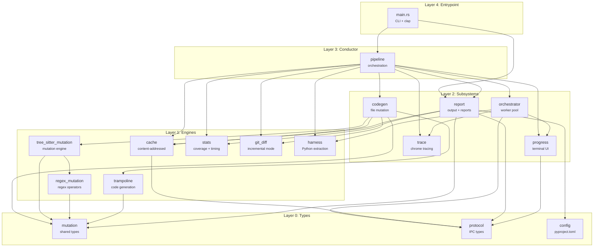
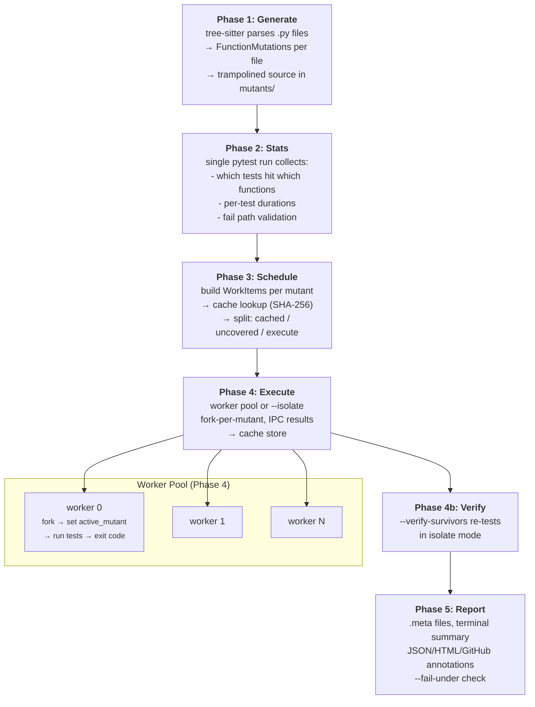

# Architecture

irradiate's architecture and execution model. Useful for contributors and anyone curious about how mutation testing works under the hood.

## Why

Mutation testing is painfully slow. The bottleneck isn't generating mutants; it's running the test suite once per mutant. A typical mutation testing run looks like:

```
for each of 1000 mutants:
    fork process
    start pytest from scratch (200-500ms)
    run relevant tests (50ms)
    collect result
```

pytest startup dominates. The actual test execution is often a fraction of the ceremony around it. irradiate exists to eliminate that ceremony.

### Background

mutmut's original author [described](https://kodare.net/2016/12/01/mutmut-a-python-mutation-testing-system.html) wanting to use Python import hooks to mutate code at runtime, enabling parallelism. He abandoned the approach because Python's import system was too unreliable. The fallback (disk-based mutation with fork-per-mutant) was pragmatic but left performance on the table. He also envisioned a shared mutation results database across developers, which was never built.

irradiate picks up these threads: the trampoline architecture (which mutmut eventually adopted) already enables runtime mutation switching without reimporting. We take it to its conclusion with a pre-warmed worker pool, and we implement the content-addressable cache he envisioned.

## Core idea: pre-warmed worker pool

Instead of paying pytest startup cost per mutant, irradiate maintains a pool of long-lived Python worker processes. Each worker:

1. Starts once
2. Imports pytest, collects all tests, resolves fixtures — once
3. Sits idle until the Rust orchestrator sends it work over a unix socket
4. Receives `(mutant_name, [test_ids])`, sets a global variable, runs the selected test items directly (no re-collection, no `pytest.main()`)
5. Reports exit code and duration back to the orchestrator
6. Waits for the next mutant

This works because of how mutation dispatch works at runtime: mutated files contain a "trampoline" function that checks which mutant is active on every call. The active mutant is a Python global variable. Switching it between test runs requires zero reimporting.

If a worker crashes (segfault, timeout), the orchestrator detects the closed socket, records the result, and spawns a replacement. The pool self-heals.

### Worker pool lifecycle

```
Startup:
  Rust orchestrator spawns N workers (N = cpu count)
  Each worker: connect to unix socket, import pytest, collect tests, report ready

Steady state:
  Orchestrator sends work item → worker sets active_mutant, runs tests, reports result
  Orchestrator tracks wall-clock time per worker, sends SIGXCPU on timeout
  If worker dies → orchestrator detects closed socket, records result, spawns replacement

Shutdown:
  Orchestrator sends shutdown message to all workers
  Workers exit cleanly
```

### IPC protocol

Newline-delimited JSON over unix domain sockets:

```
Orchestrator → Worker:
  {"type":"warmup"}
  {"type":"run","mutant":"my_lib.x_hello__irradiate_1","tests":["tests/test.py::test_hello"]}
  {"type":"shutdown"}

Worker → Orchestrator:
  {"type":"ready","pid":12345}
  {"type":"result","exit_code":1,"duration":0.042}
  {"type":"error","message":"..."}
```

## Module dependency graph

Generated from `cargo modules dependencies`. Arrows point from importer to dependency. The graph is a clean DAG — no cycles.



## Execution pipeline

Data flow through a single `irradiate run` invocation:



## Component overview

```
irradiate (Rust binary)
├── CLI (clap)
├── Mutation Engine
│   ├── Python parser (tree-sitter + tree-sitter-python)
│   ├── 28+ mutation operator categories
│   ├── Regex pattern mutation (regex-syntax crate)
│   ├── Trampoline code generation (descriptor-aware)
│   └── Parallel file processing (rayon)
├── Worker Pool Orchestrator
│   ├── Fork-per-mutant inside pre-warmed workers
│   ├── Unix domain socket IPC (tokio)
│   ├── Timeout management (tokio timers)
│   └── Work queue sorted by estimated execution time
├── Incremental Mode
│   ├── Git diff parsing (--diff <ref>)
│   ├── Merge-base resolution for branch comparisons
│   └── Function-level filtering (only mutate touched functions)
├── Cache
│   ├── Content-addressable result store (SHA-256)
│   └── Incremental mutation detection
├── Reporting
│   ├── JSON (Stryker mutation-testing-report-schema v2)
│   ├── HTML (mutation-testing-elements web component)
│   ├── GitHub Actions annotations + step summary
│   └── Terminal summary
├── Result Store
│   ├── .meta JSON files
│   ├── Stats JSON (test-to-mutant mapping, durations)
│   └── Batched writes
```

A small Python package (`irradiate-harness`) ships alongside the binary. It contains:

- `worker.py`: the pytest worker loop
- `stats_plugin.py`: pytest plugin for recording which tests cover which functions
- `import_hook.py`: MutantFinder import hook (intercepts imports, loads trampolined code)
- `trampoline.py`: holds the `active_mutant` global that the trampoline reads

## What stays Python

Three things must remain Python because they run inside the test process:

1. The trampoline, injected into mutated source files. Dispatches function calls based on `active_mutant` global using a module-level dict lookup (no syscall).
2. The worker process. Connects to a unix socket, receives work, forks a child per mutant, reports results.
3. The stats plugin. A pytest plugin that records which tests execute which trampolined functions.

Everything else (parsing, mutation, orchestration, caching, I/O, CLI) is Rust.

## Content-addressable cache

mutmut caches results by file modification time: if the source is newer than the mutant file, regenerate. This is fragile: `touch` a file, lose all results. Rebasing drops results even if code didn't change. Results aren't shareable across developers or CI.

irradiate uses content-addressable caching. The v1 local cache keys each mutation result by:

```
cache_key = hash(
    irradiate_version,          # invalidates old entries when operators/runtime change
    function_body_exact,        # exact function source for correctness-first v1
    mutation_descriptor,        # operator + span + original + replacement
    test_set_hash,              # hash of the sorted test IDs that cover this function
    test_content_hash,          # hash of the test file contents
)
```

If the key matches a previous result, skip the test run entirely. This survives:

If the function didn't change, the result holds across rebases and branch switches.

### Cache storage

Local cache lives in `.irradiate/cache/` as a directory of small files keyed by hash prefix (similar to git's object store). `irradiate cache clean` removes only this directory. Remote/shared cache is follow-up work.

### Cache invalidation

The cache is naturally self-invalidating: if any input to the hash changes (function body, test code, operator definition), the key changes and the old result is simply never looked up. No explicit invalidation needed. Old cache entries can be garbage-collected by age.

## Mutation operators

### Design: declarative tables over procedural code

mutmut's operators are Python functions that take CST nodes and yield mutated variants. They work, but adding a new operator requires understanding the tree-sitter node API, writing match logic, and handling edge cases.

irradiate splits operators into two categories:

Most operators are table-driven, defined as static data:

```rust
// Adding a new swap is one line
static BINARY_OP_SWAPS: &[(BinOp, BinOp)] = &[
    (BinOp::Add, BinOp::Sub),
    (BinOp::Sub, BinOp::Add),
    (BinOp::Mul, BinOp::Div),
    (BinOp::Div, BinOp::Mul),
    (BinOp::Eq, BinOp::NotEq),
    (BinOp::Lt, BinOp::LtE),
    // ...
];

static KEYWORD_SWAPS: &[(Keyword, Keyword)] = &[
    (Keyword::And, Keyword::Or),
    (Keyword::Is, Keyword::IsNot),
    (Keyword::In, Keyword::NotIn),
    (Keyword::Break, Keyword::Return),
    (Keyword::Continue, Keyword::Break),
];

static BOOL_SWAPS: &[(Name, Name)] = &[
    ("True", "False"),
    ("False", "True"),
    ("deepcopy", "copy"),
];

static METHOD_SWAPS: &[(&str, &str)] = &[
    ("lower", "upper"),
    ("upper", "lower"),
    ("lstrip", "rstrip"),
    ("rstrip", "lstrip"),
    ("find", "rfind"),
    ("rfind", "find"),
];
```

A generic walker applies all table-driven operators by matching node types against the tables. No per-operator visitor logic needed.

Operators that require structural analysis (argument removal, string mutation, lambda mutation, assignment mutation, match case removal) are implemented as individual functions in `tree_sitter_mutation.rs` that walk tree-sitter nodes and call `record_mutation()` for each variant they produce.

### Operator skip rules

Certain patterns should never be mutated:

- `# pragma: no mutate` on the same line
- Lines not in the coverage set (when `--covered-only` is enabled)
- Dunder methods that affect object identity: `__getattribute__`, `__setattr__`, `__new__`
- Calls to `len()`, `isinstance()` (mutations here rarely produce useful signal)
- Type annotations
- Non-descriptor decorator expressions (@cache, @app.route, etc. — @property/@classmethod/@staticmethod are handled)
- Enum subclass methods, functions with `nonlocal`
- Docstrings (triple-quoted strings)

### Operator catalog

| Category | Mutations | Type |
|----------|-----------|------|
| Arithmetic | `+` ↔ `-`, `*` ↔ `/`, `//`, `%`, `**` | Table |
| Comparison | `<` ↔ `<=`, `>` ↔ `>=`, `==` ↔ `!=` | Table |
| Logical | `and` ↔ `or` | Table |
| Bitwise | `&` ↔ `\|` ↔ `^`, `<<` ↔ `>>` | Table |
| Boolean | `True` ↔ `False` | Table |
| Keywords | `is` ↔ `is not`, `in` ↔ `not in`, `break` → `return` | Table |
| Unary removal | `not x` → `x`, `~x` → `x` | Table |
| String methods | `.lower()` ↔ `.upper()`, `.lstrip()` ↔ `.rstrip()` | Table |
| Numbers | `n` → `n + 1` | Procedural |
| Strings | case swap, `"XX"` wrapping | Procedural |
| Lambdas | body → `None` | Procedural |
| Arguments | remove args, replace with `None` | Procedural |
| Assignments | `a = x` → `a = None`, `+=` → `=` | Procedural |
| Match | drop case branches | Procedural |

## The trampoline

Every mutated function gets a thin wrapper that checks a module global (`irradiate_harness.active_mutant`) to decide whether to run the original code, a mutated variant, or a special mode (stats collection, forced failure). The dispatch is a single dict lookup per call. When no mutation is active, the overhead is one falsy check (~100ns).

This is what enables the worker pool: switching mutants is just flipping a global variable, not restarting pytest. For the full code listing, naming conventions, special modes, and descriptor handling, see [The Trampoline](trampoline.md).

## Execution phases

### Phase 1: Mutation generation

```
for each .py file in paths_to_mutate (parallel via rayon):
    parse with tree-sitter Rust crate
    walk CST, apply operators, collect mutations grouped by function
    for each function with mutations:
        emit original (renamed), variants, lookup dict, trampoline wrapper
    write combined mutated source to mutants/
    write .meta stub (mutant names, no results yet)
```

### Phase 2: Stats collection

Run the full test suite once with `active_mutant = "stats"`. The trampoline calls `record_hit()` for every instrumented function, building:

- `tests_by_function`: which tests exercise which functions
- `duration_by_test`: how long each test takes

Saved to `mutants/irradiate-stats.json`. On subsequent runs, only re-collect stats for new or changed tests.

### Phase 3: Validation

- **Clean run**: all tests pass with no mutant active
- **Forced fail**: `active_mutant = "fail"` — at least one test must fail (verifies trampoline is wired up)

### Phase 4: Mutation testing

```
sort mutants by estimated execution time (fastest first)
for each mutant:
    check cache → if hit, record result, skip
    check type checker → if caught, record exit_code=37, skip
    if no tests cover this function → record exit_code=33, skip
    send to next available worker
    worker sets active_mutant, runs tests with -x (fail-fast)
    worker reports exit_code and duration
    orchestrator records result, updates cache
```

### Phase 5: Results

Aggregate results from all `.meta` files. Classify each mutant:

| Exit code | Status | Meaning |
|-----------|--------|---------|
| 0 | survived | Tests passed — mutant not caught |
| 1 | killed | Tests failed — mutant detected |
| 33 | no tests | No tests cover this function |
| 37 | type check | Caught by static type checker |
| timeout | timeout | Tests exceeded time limit |
| -11 | segfault | Worker crashed |

## Where the speed comes from

1. **No pytest startup per mutant** — workers collect once, run many times. For a 200ms pytest startup with 1000 mutants, this saves ~200 seconds.
2. **Content-addressable cache** — unchanged functions with unchanged tests skip entirely. On incremental runs (one file changed), most mutants are cache hits.
3. **No `os.environ` syscall in the trampoline** — module global instead of env var lookup on every function call. For code with thousands of instrumented function calls per test, this adds up.
4. **Parallel mutation generation** — rayon, no GIL, no multiprocessing.Pool overhead.
5. **Batched result I/O** — not a JSON write after every single mutant (mutmut has a TODO comment acknowledging this bottleneck).
6. **Native orchestration** — tokio manages sockets, timers, signals without GIL contention.

## Compatibility with mutmut

irradiate produces the same output format as mutmut:

- Same mutant naming convention (`module.xǁClassǁmethod__irradiate_N`)
- Same `.meta` JSON files in `mutants/`
- Same `mutmut-stats.json` format
- Same trampoline architecture (function renaming + dispatch)
- Same `# pragma: no mutate` support
- Same `[tool.mutmut]` config section in `pyproject.toml`

Correctness is validated by running both tools against the same projects and diffing the results.

### Compatibility test suite

- mutmut's `e2e_projects/` (basic coverage)
- Real-world projects for stress testing: a Django app, a data pipeline, a CLI tool
- For each: run mutmut, run irradiate, diff the mutant names and exit codes

## Worker execution model

Two user-visible execution modes:

- **Default worker-pool mode** (warm session + hook-driven execution): keep a pytest session alive inside each worker, collect once, then execute pre-collected items via pytest's hook machinery (`pytest_runtest_protocol`, `pytest_runtest_logreport`) for each mutant. This is closest to how `pytest-xdist` workers behave.
- **`--isolate` mode**: run each mutant in a fresh subprocess for maximum correctness at the cost of startup overhead.

### Why warm sessions

On a typical project with 200ms pytest startup and 1000 mutants:
- **Subprocess per mutant**: 1000 × 200ms = 200 seconds of pure startup overhead
- **Warm session**: 1 × 200ms + 1000 × (test time only) ≈ 200ms + test time
- For fast tests (50ms each), this is the difference between 250s and 50s — a 5× speedup

### State isolation in warm sessions

Three layers of defense against state leakage:

1. **Module state snapshot/restore**: between mutant runs, the worker snapshots `vars()` of all source-under-test modules and restores them after each run. Warning registries are also cleared.
2. **Session-fixture detection + auto-tuned recycling**: when session-scoped fixtures are detected, the orchestrator reduces the recycling interval (100 → 20). Workers are recycled via `--worker-recycle-after`.
3. **`--verify-survivors`**: after warm-session testing, re-tests all survived mutants in `--isolate` mode. Result discrepancies are corrected and the cache is updated.

Residual risk: deep mutations to mutable module-level objects (dict/list contents) are not caught by shallow snapshot/restore. Selective `importlib.reload()` is tracked as future work (GitHub #7).

### Fork-per-mutant (default)

The default execution model: each worker forks a child process for each mutant. The parent holds the collected pytest session and never accumulates post-run state. The child sets `active_mutant`, runs the selected tests, and calls `os._exit()`. This gives subprocess-level isolation without paying pytest startup on each mutant.

## Risks and mitigations

**Test state leakage in worker pool**: Mitigated by module snapshot/restore, auto-tuned recycling, and `--verify-survivors`. See "State isolation in warm sessions" above.

**tree-sitter Rust crate gaps**: The Rust crate may not cover all Python syntax that the Python tree-sitter handles. Mitigations:
- Fall back to copying files unchanged when parsing fails (same as mutmut)
- Track which syntax constructs cause parse failures, file issues upstream
- The tree-sitter Rust crate is the same parser that powers the Python tree-sitter — it's actively maintained and handles Python 3.0-3.14

**Plugin compatibility**: Some pytest plugins assume one session = one logical run, or accumulate mutable state. Mitigations:
- Worker recycling bounds accumulation
- `--isolate` as a fallback for incompatible suites
- Systematic plugin compatibility testing planned (GitHub #11)

**Cache correctness**: A bad hash function could cause false cache hits. Mitigations:
- Use SHA-256 for content hashing
- Include the irradiate version in the cache key (operator changes invalidate cache)
- Cache entries are never updated, only created — eliminates race conditions
